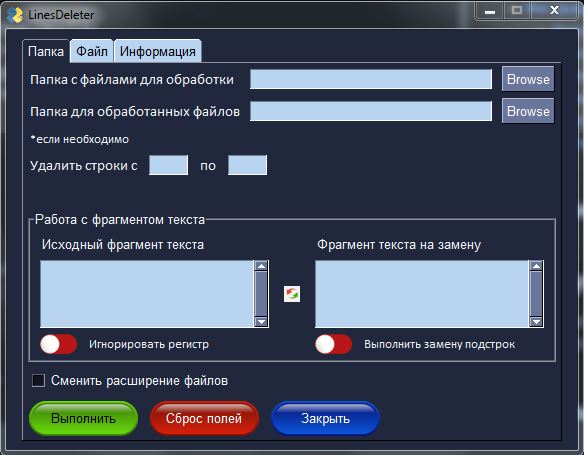

<h1>LinesDeleter</h1>

<h2>Содержание</h2>
<ul>
    <li><a href=#Description>Описание</a></li>
    <li><a href=#Instruction>Инструкция по работе</a></li>
<ul>
<li><a href=#Ver_1.0>Версия 1.0</a></li>
<li><a href=#Ver_1.5>Версия 1.5</a></li>
</ul>
    <li><a href=#Pip>Используемые бибилиотеки</a></li>
    <li><a href=#Resume>Примечания</a></li>
    <li><a href=#TechInfo>Техническая информация</a></li>
    <li><a href=#Version>Версии продукта</a></li>
</ul>

<h2 id ="Description">Описание</h2>
Программа предназначена для удаления определенных строк, замены или удаления текста по заданному шаблону, 
а также изменения расширения файлов.

<i>Общий вид программы при ее запуске (Версия 1.5)</i>

Среди возможностей програмы - работа функций, как отдельно, так и совместно, однако следует учитывать, 
что последовательность их выполнения осуществляется согласно интерфейса - сверху-вниз, т.е. сначала
удаляться строки, далее выполниться замена/удаление текста (по шаблону), согласно выбранных настроек и 
затем изменение расширения файл(а/ов).

<h2 id="Instruction">Инструкция по работе</h2>

Версия 1.0

<ul>
<li><a href="View_V.1">Общая информация</a></li>
<li><a href=#Folder_V.1>Вкладка "Папка"</a></li>
<li><a href=#File_V.1>Вкладка "Файл"</a></li>
<li><a href=#Info_V.1>Вкладка "Информация"</a></li>
</ul>

<h3 id="View_V.1">Общая информация</h3>

Программа (ver. 1.0) предназначена для удаления первых строк из текстовых файлов.

<i>Общий вид программы при ее запуске (Версия 1.0)</i>

Дополнительной функцией является возможность изменения расширения файлов, которую можно использовать как отдельно,
так и в группе с функцией удаления строк. Программой предусмотрена возможность работы, как с группой файлов в папке - 
вкладка "Папка", так и с одиночными файлами - вкладка "Файл".

<h3 id="Folder_V.1">Вкладка "Папка"</h3>
Вкладка "Папка" представляет собой две функциональные области:
<ol>
<li>Удаление первых строк в файлах папки</li>
<li> Изменения расширения файлов в папке</li>
</ol>

<b>Первая область (1)</b> предназначена для ввода данных с целью дальнейшего удаления строк в файлах
указанной папки. Существует два варианта выполнения операции:

<ul>
<li>удаление строк непосредственно в файлах папки;</li>
<li>удаление строк в файлах папки с сохранением исходных и переноса обработанных файлов в другую папку.</li> 
</ul>

Для выполнения первой - через кнопку "Browse" поля "Папка с файлами для обработки" выбрать папку с файлами
и указать "Количество удаляемых строк". Для второй - следует дополнительно указать папку через кнопку "Browse"
поля "Папка для обработанных файлов". 

<b>Вторая область (2)</b> предназначена для ввода данных с целью изменения расширения фалов в папке.
Для ее активации необходимо выбрать чекбокс "Сменить расширение файлов", после чего откроется переключатель
и поля для заполнения. 
Возможно два пути выполнения изменения расширения:

<ul>
<li>в исходной папке;</li>
<li>перенос файлов с измененным расширением в другую папку с сохранением исходных.</li>
</ul>

Для выполнения первой операции достаточно через кнопку "Browse" указать папку с файлами для изменения расширения 
в полях "с" и "на". Для второй - следует дополнительно через кнопку "Browse" поля "Папка для обработанных файлов"
указать путь. 
 В случае смены положения переключателя "после обработки" во включенное (зеленый цвет) активируется режим объединения
двух функций, т.е. программой будет выполнено удаление строк в файлах и затем смена их расширения. В зависимости 
от заоплненных полей возможно два пути выполнения общей операции:

<ul>
<li>удаление строк в файлах и смена их расширения в исходной папке;</li>
<li>удаление строк в файлах и смена их расширения с переносом в другую папку (сохранение исходных файлов в папке);</li>
</ul>

Как и в предыдущих случаях, для выполнения первой операции следует заполнить поля "Папка с файлами для обработки",
"Количество удаляемых строк", а также поля "с" и "на". Для второй дополнительно следует заполнить поле 
"Папка для обработанных файлов". 
Для отключения режима совместного выполнения функций следует перевести переключатель "после обработки" в выключенное 
состояние - красный цвет.

<h3 id="File_V.1">Вкладка "Файл"</h3>

Принципиальное отличие вкладки "Файл" от вкладки "Папка" заключается в том, что во второй происходит
обработка всех, находящихся в указанной папке, файлов, а вкладка "Файл" предназначена для обработки одного файла,
выбранного пользователем. 
Вкладка "Файл" представляет собой две функциональные области:

<ol>
<li>Удаление первых строк в файлах папки</li>
<li> Изменения расширения файлов в папке</li>
</ol>

<b>Первая область (1)</b> предназначена для ввода данных с целью последующего удаления строк в файле. Возможно два пути использования области:

<ul>
<li>удаление строк в исходном файле</li>
<li>удаление строк в файле с переносом его в другую папку с сохранением исходного.</li>
</ul>

Для первого случая через кнопку "Browse" поля "Файл для обработки" следует указать путь к файлу и количество
удаляемых строк в поле "Количество удаляемых строк". Для второго через кнопку "Browse" поля 
"Папка для обработанного файла" необходимо дополнительно выбрать папку.

<b>Вторая область (2)</b> предназначена для изменения расширения файла и активируется сменой положения 
переключателя на включенное (зеленый цвет). Возможно два пути использованя области:

<ul>
<li>изменение расширения файла в исходной папке;</li>
<li>перенос файла с измененным расширением в другую папку с сохранением исходного.</li>
</ul>

Для первого варианта необходимо указать путь к файлу через кнопку "Browse" поля "Файл для обработки" и заполнить
поля "с" и "на". Для второго необходимо через кнопку "Browse" поля "Папка для обработанного файла" дополнительно
указать папку для измененного файла

Программой предусмотрена возможность объединения работы функций удаления строк в файле и изменения его расширения.
При совместной работе следует отметить два возможных варианта:

<ul>
<li>удаление строк и изменение расширения в исходном файле;</li>
<li>удаление строк и изменение расширения файла с переносом его в другую папку (сохранение исходного файла)</li>
</ul>

Для первого случая необходимо заполнить все поля кроме "Папка для обработанного файла", 
а для второго - заполнить и его.

<h3 id="Info_V.1">Вкладка "Информация"</h3>

Вкладка носит информативный характер и создана, чтобы в краткой форме описать функциональные возможности
программы, а также предоставить ссылку на исходный код и обновленную версию.

Версия 1.5

<ul>
<li><a href=#View_V.1.5>Общая информация</a></li>
<li><a href=#Folder_V.1.5>Вкладка "Папка"</a></li>
<li><a href=#File_V.1.5>Вкладка "Файл"</a></li>
<li><a href=#Info_V.1.5>Вкладка "Информация"</a></li>
</ul>

<h3 id="View_V.1.5">Общая информация</h3>

Версия программы 1.5 претерпела, некоторые функциональные изменения, по сравнению с предыдущей (1.0).
Так, подверглась переработке функция удаления строк, которая принимает номер строк (поля с/до) и затем выполняет
удаление в заданном интервале. Добавлена возможность замены текста по заданному шаблону и его удаление.  
Программой поддерживается возможность использования функций, как по отдельности, так и совместно, выполнение которых
осуществляется по интерфейсу - сверху-вниз.
Для удобства работы предусмотрена работа, как с файлами в папке, так и с одним файлом, с возможностью сохранения
обработанного(ых) файлов в отдельной папке.

<h3 id="Folder_V.1.5">Вкладка "Папка"</h3>

Вкладка "Папка" представляет собой 5 функциональных зон:

<ol>
<li>"Путевая" зона;</li>
<li>Удаление строк;</li>
<li>Замена или удаление текста по заданным параметрам;</li>
<li>Смена расширения;</li>
<li>"Операционная" зона.</li>
</ol>

<b>"Путевая" зона (1)</b> необходима для указания путей к папке с файлами, которые следует обработать, - 
"Папка с файлами для обработки", и папке, куда следует сохранить обработанные файлы - "Папка для обработанных файлов".
Если не указать путь в поле "Папка для обработанных файлов", то изменению подвергнуться исходные файлы.

Зона <b>Удаление строк(2)</b> представляет собой два поля - "с" и "по", в которых указываются числа, соответствующие
позиции строки в файле, которые следует удалить из него. Удаление осуществляется по заданному интервалу, например,
с 1 по 5, с 3 по 3 (будет удалена одна строка) и т.д. Строка соответствующая полю "по" будет удалена включительно.
Если поле "с" заполнить, а поле "по" оставить незаполненным выполнится удаление всех строк начиная со строки, указанной
в поле "с".

<b>Работа с фрагментом текста (3)</b> позволяет заменить или удалить фрагмент текста, указанный в поле
"Исходный фрагмент текста". Чтобы выполнить удаление текста достаточно заполнить поле "Исходный фрагмент текста", а
 поле "Фрагмент текста на замену" оставить пустым. 
Между полями размещена кнопка "Поменять текст местами" при нажатии на которую происходит смена содержимого полей
между собой. 
 
Для работы с фрагментом текста доступно несколько опций, которые могут быть полезны при замене одиночных слов:
<ul>
<li>"Игнорировать регистр"</li>
<li>Выполнить замену подстрок</li>
</ul>

При включении опции "Игнорировать регистр" выполнится замена текста независимо от регистра букв, т.е. слова
"кров" и "кРОв" будут равноценны, а опция "Выполнить замену подстрок" обеспечит замену в случае если слово входит в
состав другого слова, например, "кров" будет заменено, как слово "кров" и как подстрока в слове "кровля".

При включении настройки <b>"Смена расширения" (4)</b> выполниться смена расширения файла с указанного в поле "с" на
указанное в поле "на".

<b>"Операционная" зона (5)</b> представлена 3-мя кнопками:

<ul>
<li>"Выполнить" - запускает выполнение операции по заданным во вкладке параметрам и введенным данным;</li>
<li>"Сброс полей" - удаляет текст во всех заполняемых полях программы;</li>
<li>"Закрыть" - завершает работу программы.</li>
</ul>

<h3 id="File_V.1.5">Вкладка "Файл"</h3>

Вкладка "Файл", как и вкладка "Папка представляет собой 5 функциональных зон:

<ol>
<li>"Путевая" зона;</li>
<li>Удаление строк;</li>
<li>Замена или удаление текста по заданным параметрам;</li>
<li>Смена расширения;</li>
<li>"Операционная" зона.</li>
</ol>

Основные функции вкладки "Файл" аналогичны оным во вкладке "Папка" с единственным различием, что
на данной вкладке работают только с одним файлом.

<h3 id="Info_V.1.5">Вкладка "Информация"</h3>

Вкладка носит информативный характер и создана, чтобы в краткой форме описать функциональные возможности
программы, а также предоставить ссылку на исходный код и обновленную версию.

<h2 id="Pip">Используемые бибилиотеки</h2>
Для запуска из IDE необходима установка PySimpleGui:
<code>pip install PySimpleGUI</code>

<h2 id="Resume">Примечания</h2>
<ol>
<li>Программа не является конвертером, а лишь меняет расширение;</li>
<li>Если в качестве папки с файлами для обработки указать пустую папку, а затем нажать "Выполнить" - 
программа не отреагирует и будет ждать файлы в папке; </li>
<li>Кнопка "Сброс полей" очищает заполненные поля во всех вкладках;</li>
<li>При сохранении обработанных файлов в новую папку могут-быть потеряны метаданные файла(ов);</li>
<li>Обработка файлов с большим текстовым объемом (более 10000 символов) зависит от технических
возможностей ПК и впринципе нерекомендуется.</li>
</ol>

<h2 id="TechInfo">Техническая информация</h2>
Программа написана на языке <b>Python 3.8</b>. Графический интерфейс выполнен с привлечением оболочки
Python API модуля Tkinter - <b>PySimpleGui</b>. Исполняемый exe-файл (если Вам таковой попался) создан с помощью <b>PyInstaller</b>. 
<b>ВАЖНО</b> знать, что замена или удаление текста осуществляется по кодировке utf-8. 
При сохранении обработанных файлов в сторонней папке терятся часть их метаданных.  

<h2 id="Version">Версии продукта</h2>
v.1.0 - выпущена 13.09.2023 
Возможности: удаление первых строк, смена расширения текстовых файлов, возможность использования функций 
как отдельно, так и совместно.  
v.1.5 - выпущена 13.10.2023  
Возможности: удаление определенных строк, замена и удаление текста по заданному шаблону с учетом регистра и подстрок, 
смена расширения текстовых файлов
